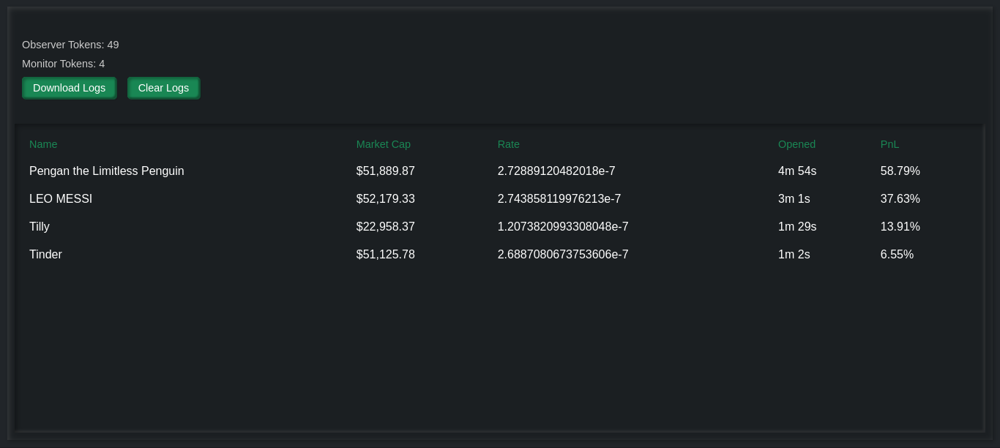

# Monitor

## Status

Active Development

## Description

This is part of the `Solana Trenches` project aimed at developing a a component that monitors pump.fun for the "next big thing" to implement its **Degen Trading Protocol**.

## Requirements

Not specified at the moment

## Roadmap

This repository is about to get real sensitive. Due to this, further development will be done privately.

The "V Break - Public Deprecation" marks its migration to a private repository and the final commit to this repository.

Hit me up if you wish to collaborate on this.

See you at the wars.

Happy Val.

## Update

Finished development privately on 16/02/2025 at 18:00. It now runs a token through various stages for it to be picked.

1. **Launch**  
    It detects tokens immediately they are launched, and if they meet configured requirements (e.g. Minimum amount of SOL in IntitalBuy or BondingCurve), they get added to the PAO.

2. **Pre-Audit Observer (PAO)**  
    This monitors tokens and they meet required Marketcap and Volume within a configured timeframe, they get sent to Audit. It discards tokens that stop receiving new data or with expired timeframes. Maximum number of tokens that can be observed at a time can also be configured.

3. **Audit**  
    This performs various audit on tokens in its queue based on available data and configured constraints. The audit scope may include:  
    - Replies (amount of replies, unqiue replier ratio, how diverse the replies are). 
    - Developer Tokens (how successful the other tokens of the developer are).
    - Developer Committment (Analysis of how much of the token the developer has sold). 
    - Holders (Analysis of all holders, top holders, the percentage they hold, their wallet ages, among others).
    - Socials (Check the social links associated with the token if they meet configured requirements).
    - Buy/Sell (Analysis buy/sell ratios and volumes).

    If audit is passed, a token is then forwarded to PAM, the final stage.

4. **Post-Audit Monitor (PAM)**  
    This is response for analysing the market data of a token, generating entry(buy/open) and exit(sell/close) signals of the token if applicable, logging decisions and PnLs, broadcasting signals to the network, among others.

A blacklisting mechanism is also implement throughout the component to blacklist developers suspected of rug pulls. Also, a simple UI is implemented.

